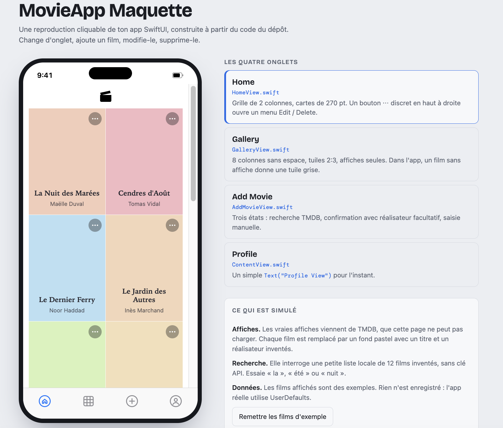
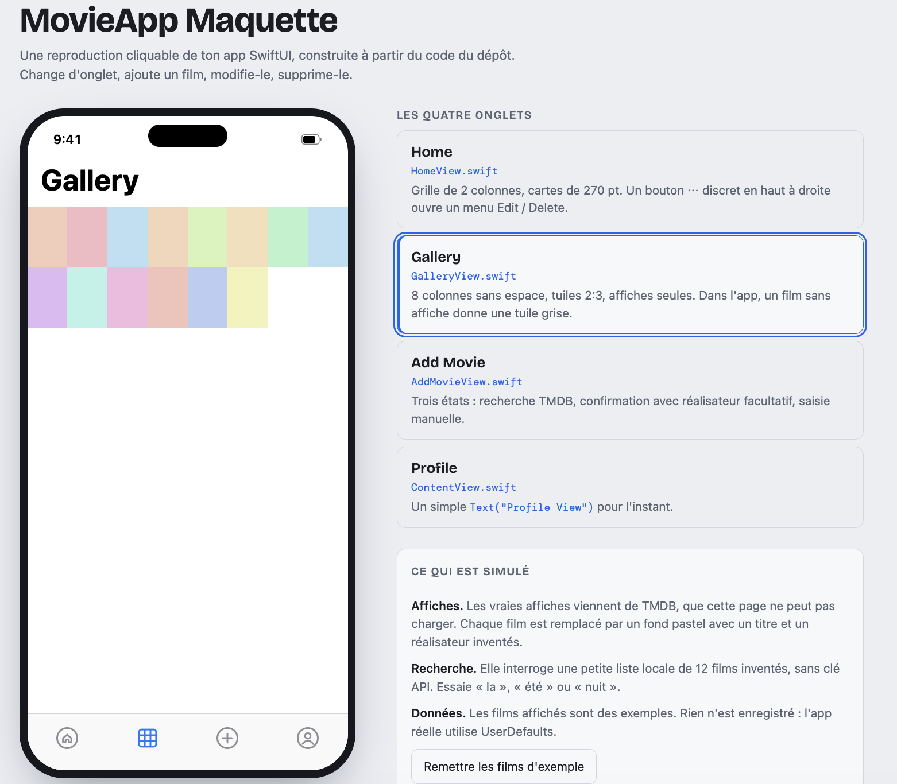
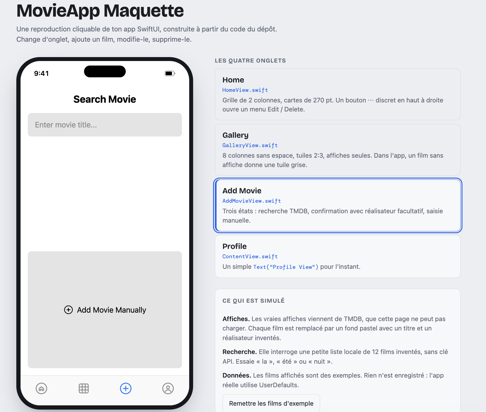
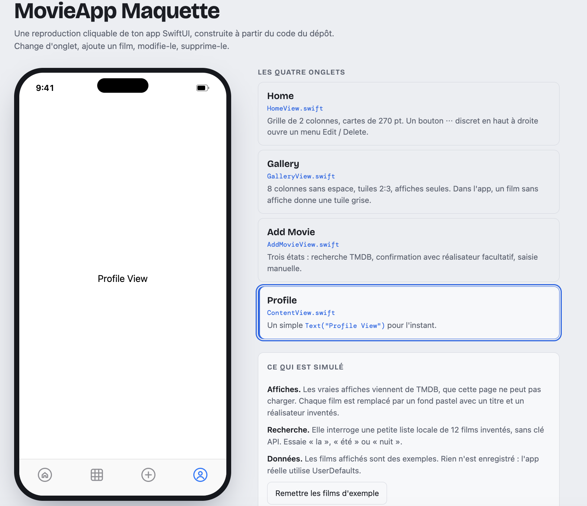

# MovieApp

A clean and simple iOS application for managing your personal movie collection and share with your friends. Built with Swift and SwiftUI, MovieApp lets you search for movies using the TMDB API, add them to your collection with poster images, and manage them with full CRUD operations.

## Features

- 🎬 **Movie Search**: Search movies using The Movie Database (TMDB) API
- 🖼️ **Poster Images**: Display movie posters fetched from TMDB
- ➕ **Add Movies**: Add movies to your personal collection
- ✏️ **Edit Movies**: Update movie information
- 🗑️ **Delete Movies**: Remove movies with confirmation dialog
- 💾 **Data Persistence**: Movies are saved using UserDefaults

## Screenshots

The app features four main screens:
- **Home Tab**: Displays your movie collection in a grid layout with posters
- **Gallery Tab**: Compact 8-column tile view showing only posters for quick browsing
- **Add Movie Tab**: Search and add new movies to your collection
- **Profile Tab**: Placeholder for future user profile features

## Mockup

An interactive HTML mockup lets you preview the app's screens without Xcode. It is rebuilt from the SwiftUI code in this repository and is a design reference, not the app itself. The screenshots below come from that mockup (its interface text is in French).

| Tab | Source file | What the mockup shows |
|---|---|---|
| Home | `HomeView.swift` | 2-column grid of 270 pt cards, with a "⋯" button opening an Edit / Delete menu |
| Gallery | `GalleryView.swift` | 8-column poster tiles with no spacing |
| Add Movie | `AddMovieView.swift` | Search, confirmation (optional filmmaker) and manual entry |
| Profile | `ContentView.swift` | Placeholder text |

<table>
  <tr>
    <td align="center"><br><sub>Home</sub></td>
    <td align="center"><br><sub>Gallery</sub></td>
  </tr>
  <tr>
    <td align="center"><br><sub>Add Movie</sub></td>
    <td align="center"><br><sub>Profile</sub></td>
  </tr>
</table>

### Design choices in the mockup

- **One actions button per card**: a discreet translucent "⋯" replaces the separate pencil and cross buttons.
- **Card title**: `.subheadline`, semibold, serif design (New York), so it scales with Dynamic Type.
- **Text on pastel cards**: dark instead of white, for readability.

### What is simulated

- Posters from TMDB are replaced by pastel backgrounds, with invented titles and filmmakers.
- Search runs on a local list of 12 invented films, without an API key.
- Nothing is saved. The real app stores movies in `UserDefaults`.

## Technologies

- **Language**: Swift
- **UI Framework**: SwiftUI
- **Architecture**: MVVM (Model-View-ViewModel)
- **API**: The Movie Database (TMDB) API
- **Data Persistence**: UserDefaults
- **Development Environment**: Xcode
- **Platform**: iOS

## Project Structure

```
MovieApp/
├── README.md                      # Project documentation
├── MovieApp.xcodeproj/            # Xcode project file
├── MovieApp/
│   ├── MovieApp.swift             # App entry point
│   ├── ContentView.swift          # Main tab view container
│   ├── HomeView.swift             # Movie grid display
│   ├── GalleryView.swift          # Compact tile gallery view
│   ├── AddMovieView.swift         # Add movie form with search
│   ├── EditMovieView.swift        # Edit movie form
│   ├── Config.swift               # Configuration settings
│   ├── Config.swift.example       # Example configuration file
│   ├── Models/
│   │   ├── Movie.swift            # Movie data model
│   │   └── TMDBModels.swift       # TMDB API response models
│   ├── Services/
│   │   ├── TMDBService.swift      # TMDB API service
│   │   └── PersistenceManager.swift # Data persistence service
│   ├── Assets.xcassets/           # App assets and resources
│   └── Preview Content/           # Preview assets for SwiftUI
├── MovieAppTests/                 # Unit tests
├── MovieAppUITests/               # UI/Integration tests
└── docs/maquette/                 # Mockup screenshots
```

## Data Model

The `Movie` struct contains:
- `id`: Unique identifier (UUID)
- `title`: Movie title
- `filmmaker`: Director or filmmaker name
- `backgroundColor`: Pastel color for card display
- `posterPath`: Optional TMDB poster path
- `tmdbId`: Optional TMDB movie ID
- `year`: Optional release year

## Getting Started

### Prerequisites

- macOS with Xcode installed
- iOS Simulator or physical iOS device for testing
- TMDB API key (for movie search functionality)

### Installation

1. Clone the repository:
```bash
git clone <repository-url>
cd MovieApp
```

2. Set up TMDB API:
   - Get your API key from [The Movie Database](https://www.themoviedb.org/settings/api)
   - Add your API key to the project configuration

3. Open the project in Xcode:
```bash
open MovieApp.xcodeproj
```

4. Select your target device (simulator or physical device)

5. Build and run the project:
   - Press `Cmd + R` or click the Run button in Xcode

## Usage

1. **Searching for Movies**:
   - Navigate to the "Add Movie" tab (plus icon)
   - Use the search functionality to find movies via TMDB
   - Select a movie to add it to your collection

2. **Adding a Movie**:
   - Search and select a movie, or manually enter details
   - Movie poster is automatically fetched from TMDB
   - The app automatically switches to the Home tab to show your new movie

3. **Viewing Your Collection**:
   - Open the Home tab (house icon)
   - Scroll through your movie collection in a grid layout
   - Each movie displays its poster, title, and filmmaker on a colorful card

4. **Gallery View**:
   - Open the Gallery tab (grid icon)
   - Browse your entire collection in a compact 8-column tile layout
   - Only posters are shown for quick visual scanning
   - Perfect for getting an overview of your collection

5. **Editing a Movie**:
   - Tap the "⋯" button on a movie card and choose **Edit**
   - Update the title or filmmaker
   - Tap **Save Changes** to save

6. **Deleting a Movie**:
   - Tap the "⋯" button on a movie card and choose **Delete**
   - Confirm deletion in the dialog
   - Movie is permanently removed from your collection

## Future Improvements

Potential features for future development:
- [ ] User authentication (sign in / sign up)
- [ ] User profile management
- [ ] Movie ratings and notes
- [ ] Categories or genres
- [ ] Advanced search and filter capabilities
- [ ] Sort options (by title, filmmaker, date added, rating)
- [ ] Export/import movie collection
- [ ] Cloud sync across devices
- [ ] Share movie lists with friends
- [ ] Movie trailers and reviews
- [ ] Watchlist functionality

## Testing

The project includes:
- Unit tests in `MovieAppTests/`
- UI tests in `MovieAppUITests/`

Run tests in Xcode:
- Press `Cmd + U` or select Product > Test from the menu

## Contributing

Contributions are welcome! Please feel free to submit a Pull Request.

## License

This project is available for personal and educational use.
